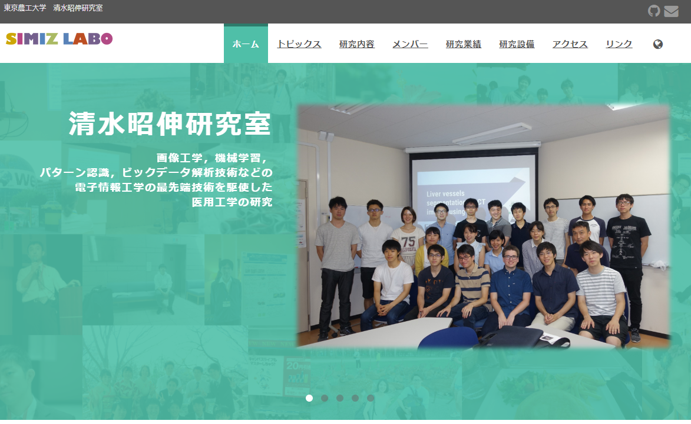
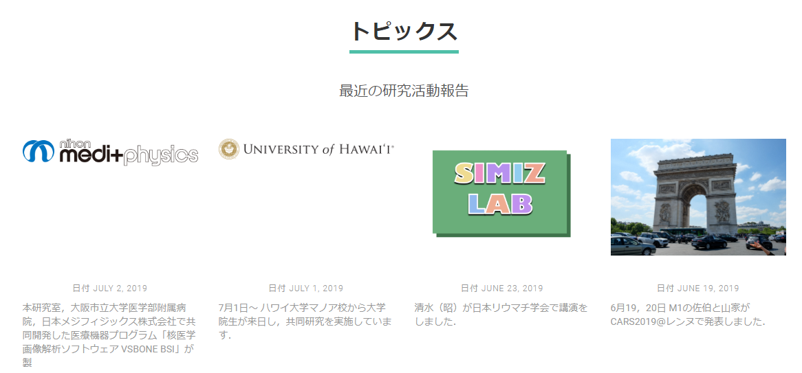
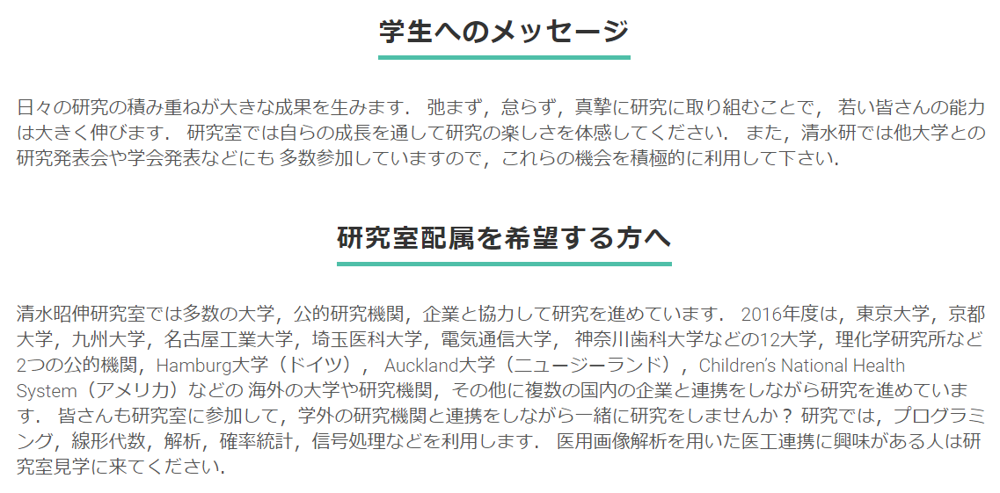
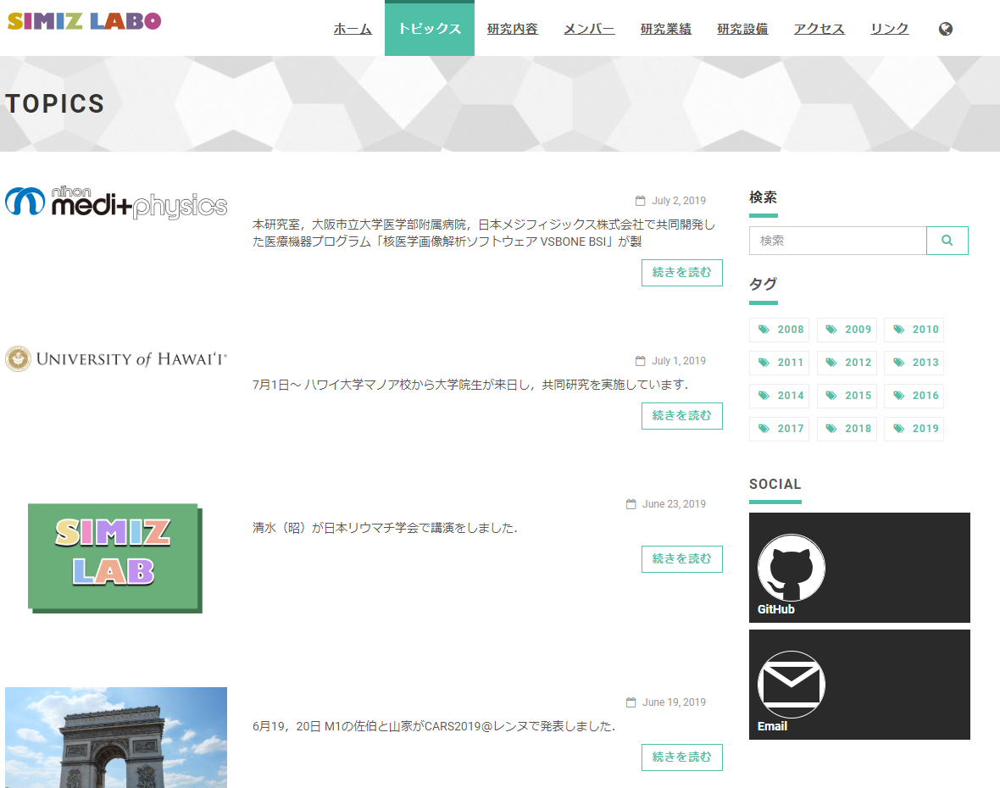

## 清水昭伸研究室のホームページ

東京農工大学　清水昭伸研究室のホームページのリポジトリです．

## Requirements

ホームページを利用するにあたって必要なツールです．

以下のバージョンにおいて，動作を確認しています．

- [HUGO](https://github.com/gohugoio/hugo)

  - Hugo Static Site Generator v0.64.1-C327E75D windows/amd64 BuildDate: 2020-02-09T20:47:34Z

- [Git](https://git-scm.com/)

  - Version: git version 2.15.1.windows.2

## 使い方

### ホームページの確認

まず，ソースコードをダウンロードします．

```bash
git clone https://github.com/simizlab/simizlab-homepage.git
cd simizlab-homepage
git submodule init
git submodule update
```

次に，ホームページの確認を行います．

```bash
hugo server # 確認
```

### ホームページの確認(スマートフォン)

スマートフォンで確認するときは，まずローカルネットにスマホを接続します．

サーバのファイアウォールの設定で `hugo` を許可します．

`コントロールパネル` ➡ `システムとセキュリティ` ➡ `Windows Defender ファイアウォール` ➡ `Windows Defender ファイアウォールを介したアプリまたは機能を許可`


次に，以下のコマンドでサーバを起動します．

```bash
hugo server --buildDrafts --watch --bind=0.0.0.0 --baseUrl=192.168.1.XX
```

スマホで `192.168.1.XX:1313` に接続すれば，確認できます．


### htmlの生成

htmlの生成を行うときは，以下のコマンドを打ちます．

```bash
hugo --minify
```

実行すると，カレントディレクトリ以下に `public` というディレクトリが生成されます．

このフォルダをサーバにアップロードすることでホームページの公開ができます．

**このとき， `config.toml` の `baseurl` を書き換えることを忘れないでください**

デフォルトは， `https://simizlab.github.io/` にしてあります．

sample
```
public
├─access
├─categories
│  └─page
│      └─1
...
```

## 機能

[Universal](https://themes.gohugo.io/hugo-universal-theme/)でも記載されていますが，いくつか紹介します．
他にも機能は存在していますが，オフにしています．

- [Carousel](#Carousel)
- [Recent posts](#Recent-posts)
- [To applicants](#To-applicants)
- [トピックス](#トピックス)


### Carousel

トップページのバーナーを表示します．



`data/carousel` 以下を編集することによって変更することができます．


### Recent posts

トピックで書いた最新の記事を表示します．



`content/topics` に記事を入れていけば変更されます．


### To applicants

清水研希望者へのメッセージを表示します．



`config.toml` における `to_applicants` のところを英語版，日本語版それぞれを編集することで設定できます．


### トピックス

投稿記事を表示します．



`content/topics` にマークダウンを入れることで新しい記事が生成されます．

`hogehoge.en.md` という拡張子の場合，英語の記事を示しています．
その記事に対応する日本語の記事のマークダウンは， `hogehoge.md` or `hogehoge.ja.md` にすることで対応関係を作ることができます．

マークダウンの一番上（front matter）には以下のことを書いてください．

```md
---
date: YYYY-MM-DD   # 日付
description : ""   # 記事の簡単な説明（省略可）
auther : ""        # 執筆者（省略可）
banner : ""        # 画像（省略可ですが，あったほうが見栄えがいいです）
draft: false　　　　# 記事を生成するかどうか（falseの場合，記事を生成します）
---
```

## 参考

- [Universal](https://themes.gohugo.io/hugo-universal-theme/)
- [Universal Theme for Hugo](https://github.com/devcows/hugo-universal-theme)
- [Mainroad](https://themes.gohugo.io/mainroad/)
- [Mainroad@github](https://github.com/Vimux/mainroad)
- [Hugo theme for MoodleBox](https://github.com/moodlebox/hugo-moodlebox-theme)
- [HUGOのサーバーをスマホから確認する](https://blog.kozakana.net/2017/11/hugo_confirm_device/)
- [HugoとGitHub Pagesで静的サイトを公開する](https://qiita.com/satzz/items/e24bd703fc04fb45f7ef#github-pages%E3%81%A7%E3%83%9B%E3%82%B9%E3%83%86%E3%82%A3%E3%83%B3%E3%82%B0%E3%81%99%E3%82%8B)
- [github初心者がhugoでサイト作成からのgithub-pagesでブログ公開の巻](https://qiita.com/nakamotoyuki/items/c0a2c05e7b0887d7f14d)
- [JQueryでFormのsubmitを調整する](https://qiita.com/icbmuma/items/92f3467a54a071280595)
- [フォームのボタンでaction先を変更するときのベストプラクティス](https://qiita.com/naoqoo2/items/f137272f84f9c10f04e6)
- [jQuery フォームボタンに応じて遷移先を変更する。](https://qiita.com/ucan-lab/items/09d3fe885778642d9456)
- [html5 フォームのバリデーションでrequiredチェックをsubmitボタン以外の操作で行いたい](https://teratail.com/questions/142544)
- [jQueryからsubmitするとHTML5 requiredが効かなくなる](https://qiita.com/maejimayuto/items/92de27c04302c2fe8567)
- [rot13.com](https://rot13.com/)
- [ROT13 Email Obfuscation](http://jsfiddle.net/HX642/6/)

## 謝辞

このサイトを製作するにあたって，協力して頂いた清水昭伸研究室の皆様に感謝の意を表します．
