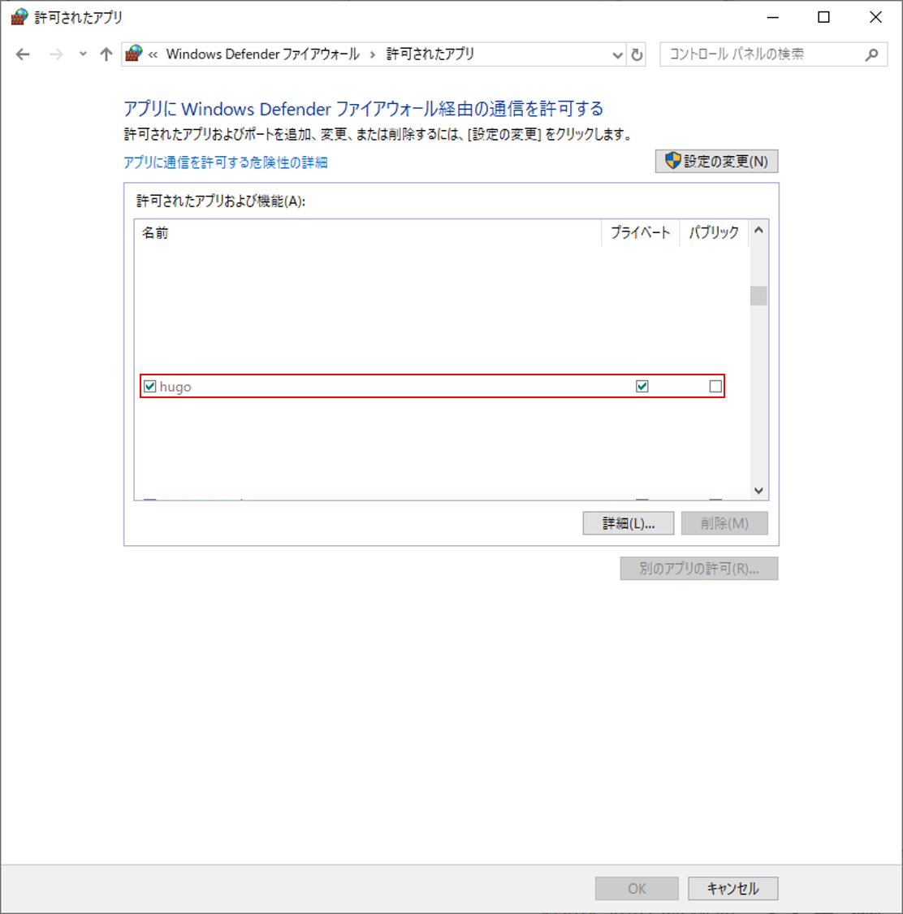

## 清水昭伸研究室のホームページ

東京農工大学　清水昭伸研究室のホームページのリポジトリです．

## Requirements

ホームページを利用するにあたって必要なツールです．

バージョンは気にしなくていいはずです．

- [HUGO](https://github.com/gohugoio/hugo)

  - Version: Hugo Static Site Generator v0.55.6-A5D4C82D windows/amd64 BuildDate: 2019-05-18T07:57:00Z

- [Git](https://git-scm.com/)

  - Version: git version 2.15.1.windows.2

## 使い方

### ホームページの確認

まず，ソースコードをダウンロードします．

```bash
git clone https://github.com/zEttOn86/simizlab-homepages.git
git submodule init
git submodule update
```

次に，ホームページの確認を行います．

```bash
hugo server # 確認
```

### ホームページの確認(スマートフォン)

スマートフォンで確認するときは，まずローカルネットにスマホを接続します．

サーバのファイアウォールの設定で `hugo` を許可します．

`コントロールパネル` ➡ `システムとセキュリティ` ➡ `Windows Defender ファイアウォール` ➡ `Windows Defender ファイアウォールを介したアプリまたは機能を許可`



次に，以下のコマンドでサーバを起動します．

```bash
hugo server --buildDrafts --watch --bind=0.0.0.0 --baseUrl=192.168.1.XX
```

スマホで `192.168.1.XX:1313` に接続すれば，確認できます．


### htmlの生成

htmlの生成を行うときは，以下のコマンドを打ちます．

```bash
hugo
```

実行すると，カレントディレクトリ以下に `public` というディレクトリが生成されます．

このフォルダをサーバにアップロードすることでホームページの公開ができます．

<u>このとき， `config.toml` の `baseurl` を書き換えることを忘れないでください</u>

sample
```
public
├─access
├─categories
│  └─page
│      └─1
...
```

## 機能


## 参考

- [Universal](https://themes.gohugo.io/hugo-universal-theme/)
- [Universal Theme for Hugo](https://github.com/devcows/hugo-universal-theme)
- [Mainroad](https://themes.gohugo.io/mainroad/)
- [Mainroad@github](https://github.com/Vimux/mainroad)
- [Hugo theme for MoodleBox](https://github.com/moodlebox/hugo-moodlebox-theme)
- [HUGOのサーバーをスマホから確認する](https://blog.kozakana.net/2017/11/hugo_confirm_device/)
- [HugoとGitHub Pagesで静的サイトを公開する](https://qiita.com/satzz/items/e24bd703fc04fb45f7ef#github-pages%E3%81%A7%E3%83%9B%E3%82%B9%E3%83%86%E3%82%A3%E3%83%B3%E3%82%B0%E3%81%99%E3%82%8B)
- [github初心者がhugoでサイト作成からのgithub-pagesでブログ公開の巻](https://qiita.com/nakamotoyuki/items/c0a2c05e7b0887d7f14d)
